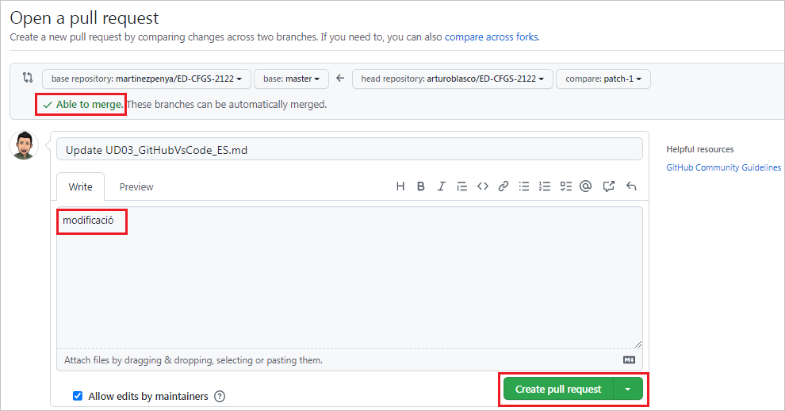
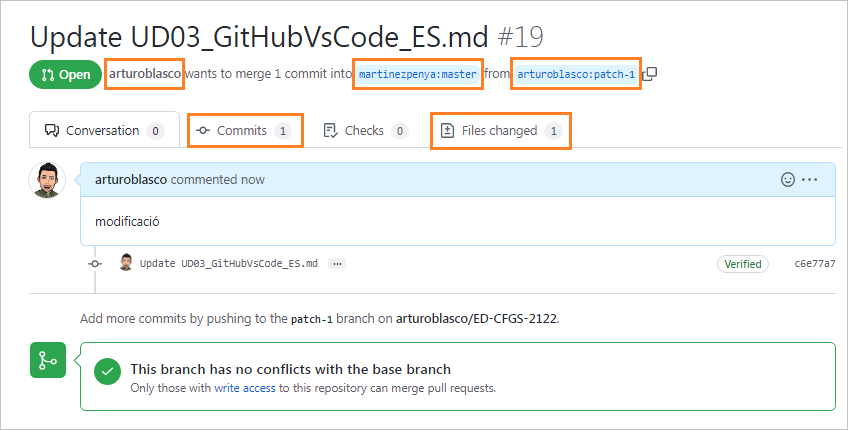

[toc]
# `VsCode` integrado en `GitHub`

## Localizar repositorio.

Primero localizamos el repositorio con el que queremos colaborar:

1. Buscamos al usuario (En todo `GitHub`):

2. Elegimos la pestaña `Repositorios` y después el repositorio en cuestión:

## Abrir `VSCode` integrado.

Github cuenta con un editor online muy potente basado en `VSCode`.

Una vez visualizamos el código del repositorio en cuestión:

para abrir el editor solo debemos pulsar la tecla "." (punto) de nuestro teclado:

Visualizaremos la estructura de carpetas y archivos en un editor `VSCode` integrado en el navegador Web.

## Modificar un archivo.

Una vez detectada la errata dentro del código [markdown](https://markdown.es/) que es muy fácil de interpretar (a poco que le dediquéis unos minutos) podemos modificar el archivo en cuestión, y a su lado aparecerá una **M** porqué el archivo está modificado.

## Git integrado

VSCode lleva integrado un gestor de GIT, el tercer icono de la barra lateral: 

1. **Verificamos** los archivos cambiados:

2. Los pasamos a "**staged area**" con el símbolo "**+**":

4. Añadimos el **comentario** del commit:

4. Realizamos el **commit**:
    

> Si el repositorio no es nuestro mostrará este mensaje:
>
> 

En realidad podemos hacer el fork antes o después, aquí tienes un pequeño [vídeo](https://www.youtube.com/watch?v=zyT0sl3-kxE) que explica qué es un fork.

A continuación nos pide el nombre de la rama que se creará y que luego podremos solicitar se incluya en el proyecto original:

Ahora nos pregunta si ya que hemos creado un fork, queremos cambiar el repositorio, y trabajar sobre nuestro fork en lugar de sobre el proyecto original, pulsamos sobre [Switch to Fork]:

Ahora ya podemos salir del editor VSCode pulsando sobre el botón de las tres lineas horizontales y elegir la opción "Go to Repository":

## Pull request

Una vez volvemos a nuestro repositorio (nuestro fork), detectará que hay cambios respecto al repositorio original y nos propone que realicemos un pull request (una petición al usuario propietario del repositorio original para que incluya nuestra modificación).

Una vez pulsado el botón [Compare & pull request] nos aparece la siguiente pantalla:

Debemos asegurarnos de que la modificación se puede agregar al repositorio original "*Able to merge*", y que indicamos en los comentarios nuestro nombre completo para que el *profesor* nos identifique. Fíjate que el nombre del pull request es el nombre del commit que hicimos desde VSCode.

Ahora debemos pulsar el botón [Create pull request].

# Tareas

##  GitHub 1

Sigue los pasos de esta práctica guiada para sugerir una modificación de cualquiera de los archivos de los repositorios del profesor [arturoblasco](https://github.com/arturoblasco). 

<ol>
    <li>Adjunta a la tarea de AULES un pdf de nombre actividad01tunombre con la captura de pantalla similar a esta donde se vé que has solicitado el pull request y que estás esperando a que se integre en el repositorio original. </li>
    <li>Explica qué significan cada uno de los 5 apartados señalados en la captura:</li></ol>

## GitHub 2

Siguiendo los pasos de la práctica anterior,:

<ol><li>crearemos un repositorio en el que un compañero propondrá un pull-request que nosotros deberemos integrar en nuestro repositorio original y viceversa. </li>
    <li>deberemos realizar un pull-request a nuestro compañero y que él lo acepte.</li></ol>

Debes adjuntar a la tarea de AULES un pdf de nombre actividad02tunombre con los pasos a seguir una vez recibido el *pull-request* para aceptarlo y que se integre en nuestro repositorio, y mostrar además donde aparece el nombre del usuario que ha colaborado con nostros en el repositorio.